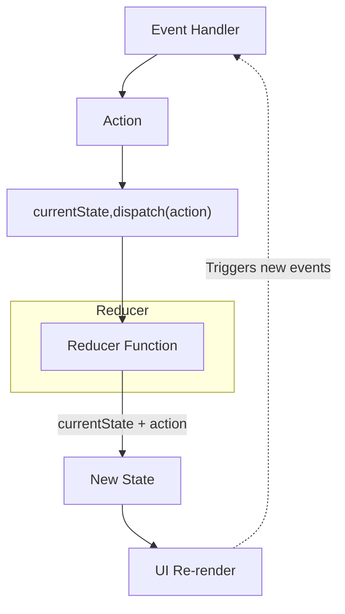
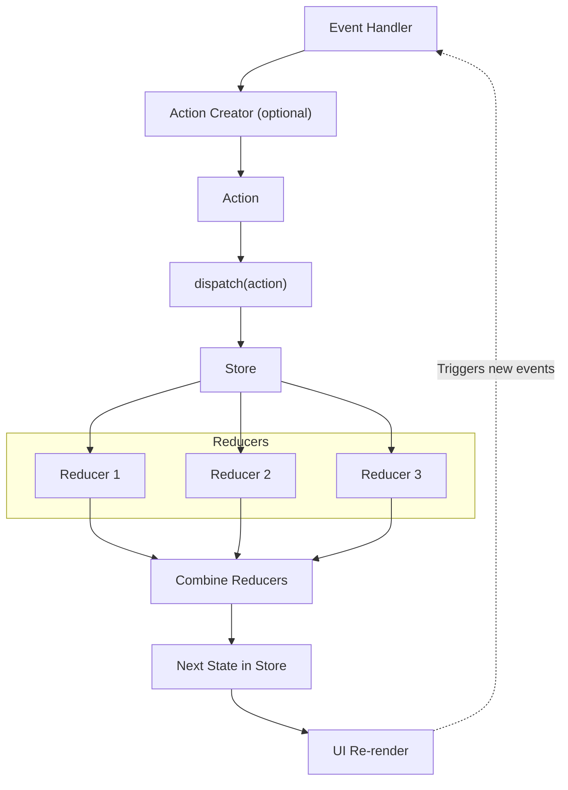
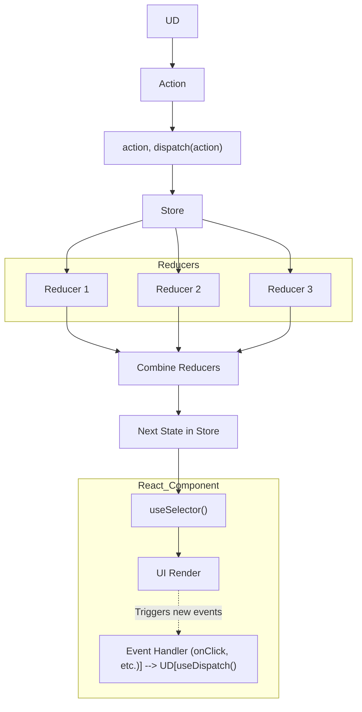

1. **React’s `useReducer` hook**
    
2. **Redux reducer flow with multiple reducers**
    

---

## 🔹 1. `useReducer` Hook Flow

---

## 🔹 2. Redux Flow with Multiple Reducers

---

⚡ Difference in words:

- **useReducer** → action goes directly to one reducer function.
    
- **Redux** → action flows through `dispatch` → store → multiple reducers (combined). Each reducer handles its slice, results are merged into a new state → re-render happens.
    

---
# Redux with React

