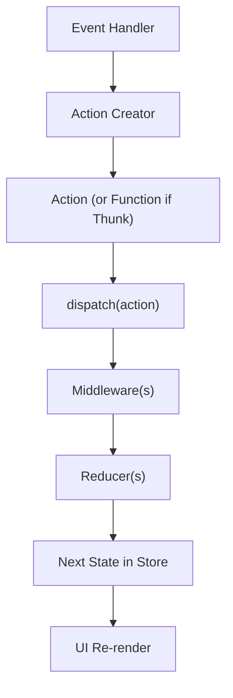
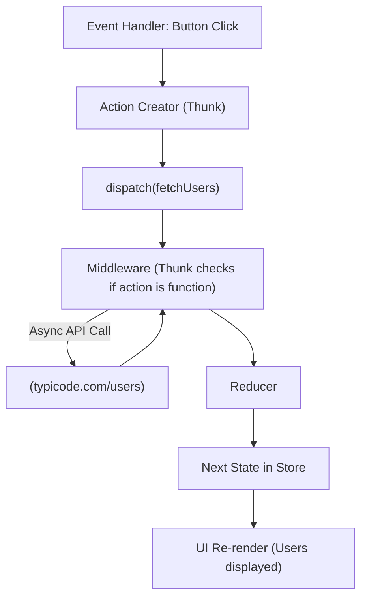

---

## 🔹 Why Reducers Can’t Have Side Effects

- **Reducers must be pure functions** → same input (state + action) should always return the same output (new state).
    
- They **should not**:
    
    - Make API calls (async operations).
        
    - Write to localStorage / console.
        
    - Trigger timers (setTimeout).
        
- Because if reducers did side effects, the **predictability and testability of Redux** would be lost.
    

So, reducers are **pure**, side effects go **elsewhere**.

---

## 🔹 Where Do Side Effects Go?

In Redux, side effects (like fetching data, logging, talking to APIs) go into **middleware**.

Middleware is like a **layer between `dispatch` and the reducers**.  
It intercepts actions and can:

- Do something **before** an action reaches reducers (e.g., logging).
    
- Perform async tasks (API calls, async/await, promises).
    
- Dispatch **new actions** when async completes.
    

---

## 🔹 How Middleware Works

Imagine the flow **without middleware**:

```
dispatch(action) → reducer → new state → UI re-render
```

With middleware:

```
dispatch(action) → middleware(s) → reducer → new state → UI re-render
```

So middleware sits **between dispatch and reducers**.

---

## 🔹 Common Middlewares

- **redux-thunk** → allows action creators to return functions (to do async/await and dispatch multiple actions).
    
- **redux-saga** → uses generator functions for complex async workflows.
    
- **redux-logger** → logs actions and states for debugging.
    

---

## 🔹 Diagram (Redux with Middleware)

Here’s a clean Mermaid flowchart:



---

👉 Example:

1. Button clicked → `fetchUsers()` action creator called.
    
2. It dispatches a thunk (function).
    
3. Middleware (`redux-thunk`) intercepts → makes API call.
    
4. When done → middleware dispatches either `FETCH_USERS_SUCCESS` or `FETCH_USERS_FAILURE`.
    
5. Reducer handles those actions → updates store.
    
6. UI re-renders with new data.
    

---
## code a **tiny Redux + Thunk example** where we fetch some fake API data.  
This will show you how async side-effects fit into Redux with middleware.

---

### 1. Setup

```bash
npm install redux redux-thunk axios
```

---

### 2. Code Example (Node.js or React works the same)

```js
const { createStore, applyMiddleware } = require("redux");
const thunk = require("redux-thunk").default;
const axios = require("axios");

// Action Types
const FETCH_USERS_REQUEST = "FETCH_USERS_REQUEST";
const FETCH_USERS_SUCCESS = "FETCH_USERS_SUCCESS";
const FETCH_USERS_FAILURE = "FETCH_USERS_FAILURE";

// Action Creators (Sync)
const fetchUsersRequest = () => ({
  type: FETCH_USERS_REQUEST,
});

const fetchUsersSuccess = (users) => ({
  type: FETCH_USERS_SUCCESS,
  payload: users,
});

const fetchUsersFailure = (error) => ({
  type: FETCH_USERS_FAILURE,
  payload: error,
});

// Action Creator (Async - Thunk)
const fetchUsers = () => {
  return function (dispatch) {
    dispatch(fetchUsersRequest()); // mark as loading
    axios
      .get("https://jsonplaceholder.typicode.com/users")
      .then((response) => {
        dispatch(fetchUsersSuccess(response.data));
      })
      .catch((error) => {
        dispatch(fetchUsersFailure(error.message));
      });
  };
};

// Initial State
const initialState = {
  loading: false,
  users: [],
  error: "",
};

// Reducer
const reducer = (state = initialState, action) => {
  switch (action.type) {
    case FETCH_USERS_REQUEST:
      return { ...state, loading: true };
    case FETCH_USERS_SUCCESS:
      return { loading: false, users: action.payload, error: "" };
    case FETCH_USERS_FAILURE:
      return { loading: false, users: [], error: action.payload };
    default:
      return state;
  }
};

// Create Store with Thunk Middleware
const store = createStore(reducer, applyMiddleware(thunk));

// Subscribe to store updates
store.subscribe(() => console.log(store.getState()));

// Dispatch the async thunk
store.dispatch(fetchUsers());
```

---

### 3. Flow (Vertical Diagram)



---

👉 This example shows:

- Reducers **only handle plain state updates**.
    
- Middleware (Thunk) lets us return a **function instead of an action**.
    
- That function can do async stuff, then dispatch normal actions (`request`, `success`, `failure`).
    

---
