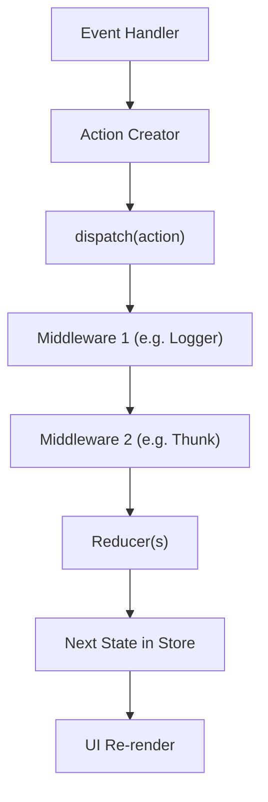

---

# 🔹 Middleware & Async / Side-Effects in Redux

## 1. ❌ Why not inside Reducers?

Reducers must always be:

- **Pure functions** → `(state, action) => newState`
    
- No side-effects like:
    
    - API calls
        
    - `setTimeout` / `setInterval`
        
    - Random values (`Math.random`)
        
    - Modifying external variables
        

If reducers had side effects, state updates would become **unpredictable and hard to test/debug**.

---

## 2. ✅ Where do Side-Effects Go?

Redux uses **middleware** to handle side-effects.

👉 Middleware is like a **pipeline between dispatching an action and reaching the reducer**.  
It can:

- Intercept actions
    
- Modify, delay, or block them
    
- Trigger async logic (API, timers, etc.)
    
- Dispatch new actions after async work
    

---

## 3. 📦 Common Middleware for Side-Effects

1. **redux-thunk** (most popular, simplest)
    
    - Lets you return a **function** instead of an action object.
        
    - That function can run async code and dispatch multiple actions.
        
2. **redux-saga**
    
    - Uses generator functions (`function*`) for more complex async flows.
        
    - Powerful for large apps with many async processes.
        
3. **redux-observable (RxJS)**
    
    - Uses reactive streams for async handling.
        
    - Best for very complex event-driven apps.
        

---

## 4. ⚡ How Middleware Works (Conceptual)

Middleware = function that **wraps `dispatch`**.

```js
const loggerMiddleware = (store) => (next) => (action) => {
  console.log("Dispatching:", action);
  let result = next(action); // pass action to next middleware/reducer
  console.log("Next state:", store.getState());
  return result;
};
```

👉 Every middleware has access to:

- `store.getState()`
    
- `store.dispatch()`
    
- The **next middleware** in the chain
    

So middlewares form a **pipeline** before the action reaches reducers.

---

## 5. 📊 Diagram (Vertical Flow)



---

## 6. 🛠 Example (Thunk with API)

```js
const fetchUsers = () => {
  return async function (dispatch) {
    dispatch({ type: "FETCH_USERS_REQUEST" });

    try {
      const response = await fetch("https://jsonplaceholder.typicode.com/users");
      const data = await response.json();
      dispatch({ type: "FETCH_USERS_SUCCESS", payload: data });
    } catch (error) {
      dispatch({ type: "FETCH_USERS_FAILURE", payload: error.message });
    }
  };
};
```

---

## ✅ Summary (Notes Style)

- **Reducers**: Pure functions → no side-effects.
    
- **Middleware**: The correct place for async logic and side-effects.
    
- **Thunk**: Easiest way → lets you dispatch functions (async).
    
- **Saga/Observable**: Advanced use cases for complex async flows.
    
- Middleware chain = Actions travel through middleware → reducers → new state → UI updates.
    

---

👉 So in short:

- Reducers = pure & predictable
    
- Middleware = async logic + side-effects manager
    

---
